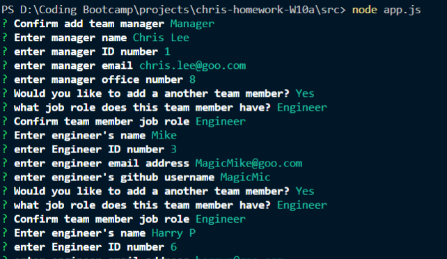
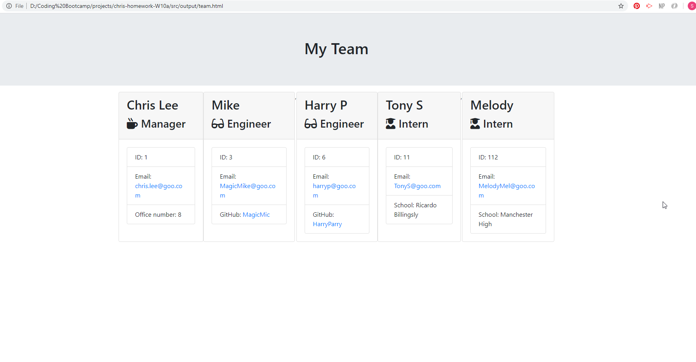

# HTML Template Engine - NodeJS

This project looks at using a command line interface (CLI) to dynamically create a HTML web page to allow the user to create a employee page for their team. The application takes into account the manager role, engineer role, and internship role with slight variation of information presented for each role type.

## Instillation

To ensure the template engine operates, the user will need to run an npm install to make sure the necessary modules are installed. Once installed simply enter into the the directory the app.js file is located and run 'node app.js' in the terminal.

## Usage
When running the application within the terminal, make sure to follow the instructions displayed, after inputting information for the manage it doesn't matter what order you put the rest of the employee details.

for each user, a name has to be in place otherwise the application will ask for the name again.

the questions asked for the manage role will include:
- name
- id number
- email address
- office number

once this has been completed, the application will ask whether you would like to add another employee, if so their role.

for engineers the questions include:
- name
- id number
- email address
- github username

for interns the questions include:
- name
- id number
- email address
- school name

## Examples

Questions asked:

HTML created using generator:

